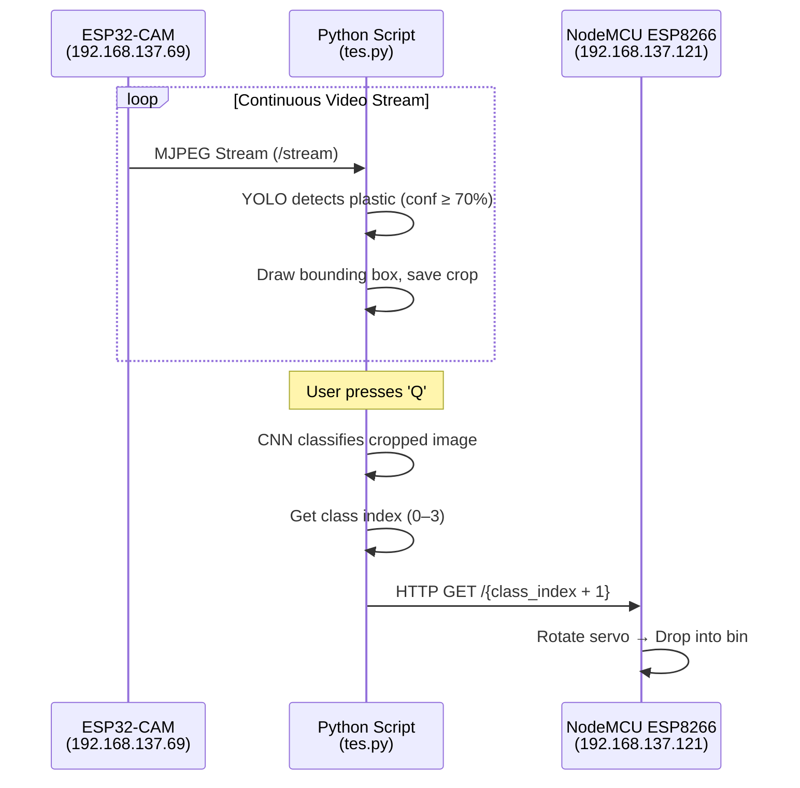
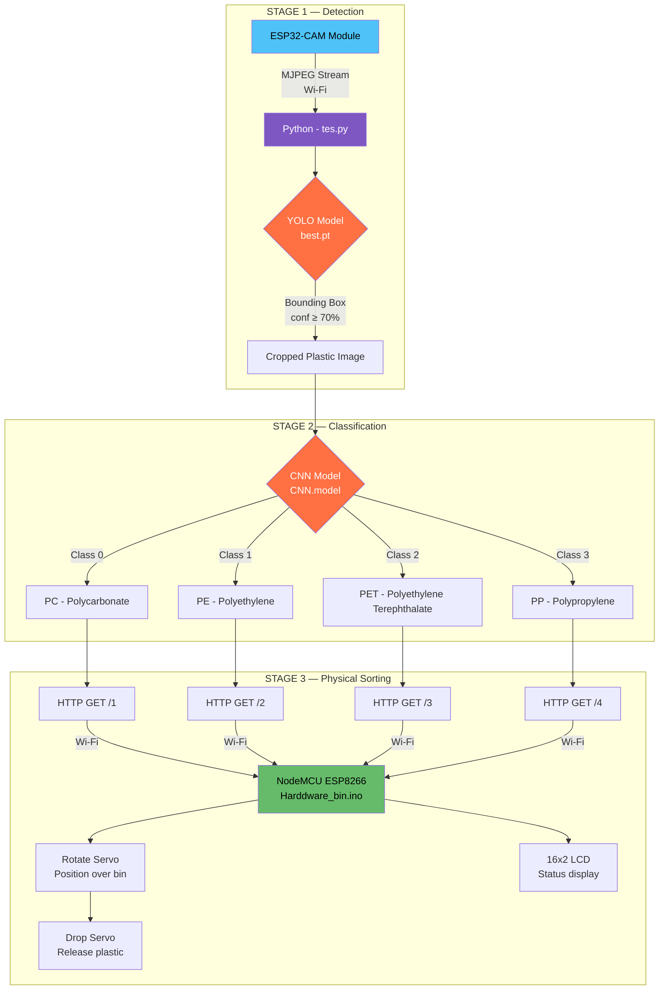

# Final Year Project — Complete Analysis & Synopsis

## 📂 Project Folder Structure

```
Final Year Project/
├── plastic.v1i.yolov8/          ← YOLO Object Detection (Stage 1: Detect)
│   ├── images/                  ← Raw dataset images (1,033 images)
│   ├── labels/                  ← YOLOv8 bounding box annotations
│   ├── train/ valid/ test/      ← Pre-split dataset folders
│   ├── dataset_split/           ← Auto-generated 80/20 train/val split
│   ├── runs/detect/             ← Training output (train, train2, val)
│   ├── data.yaml                ← Original Roboflow dataset config (39 classes)
│   ├── data_auto.yaml           ← Simplified single-class config (1 class: "waste")
│   ├── train.py                 ← Dataset split + YOLO training script
│   ├── yolov8m.pt               ← YOLOv8 Medium pre-trained weights (~52 MB)
│   └── yolo26n.pt               ← YOLOv26 Nano weights (~5.5 MB)
│
├── Plastic types/                ← CNN Classification (Stage 2: Classify)
│   ├── data/                    ← Plastic type image dataset (2,111 images)
│   │   ├── PC/   (492 images)   ← Polycarbonate
│   │   ├── PE/   (511 images)   ← Polyethylene
│   │   ├── PET/  (594 images)   ← Polyethylene Terephthalate
│   │   └── PP/   (514 images)   ← Polypropylene
│   ├── main.py                  ← CNN model training script (TensorFlow/Keras)
│   ├── tes.py                   ← 🔑 Main runtime application
│   ├── CNN.model/               ← Saved trained CNN model (TensorFlow SavedModel)
│   └── best.pt                  ← Best YOLO weights from training (~52 MB)
│
└── Arduino/                      ← Hardware Control (Stage 3: Sort)
    ├── Harddware_bin/
    │   └── Harddware_bin.ino    ← NodeMCU ESP8266 — Wi-Fi servo controller + LCD
    ├── motor/
    │   └── motor.ino            ← ESP32 — IR sensor + serial-based servo control
    └── libraries/               ← 116 Arduino libraries (Servo, LCD, WiFi, etc.)
```

---

## 🔍 Detailed Component Analysis

### Component 1: YOLO Object Detection — `plastic.v1i.yolov8/`

| Aspect | Details |
|---|---|
| **Purpose** | Detect and localize plastic objects in a camera frame |
| **Model** | YOLOv8 Medium (fine-tuned from `yolov8m.pt`) |
| **Dataset** | 1,033 images sourced from [Roboflow](https://universe.roboflow.com/charless-workspace-6omar/plastic-rbaxs-ct01g/dataset/1), CC BY 4.0 license |
| **Pre-processing** | Auto-orientation, resized to 384×384 (stretched) |
| **Training Config** | 100 epochs, image size 240, batch size 8, GPU (device 0) |
| **Key Design Decision** | All 39 original Roboflow classes are **collapsed into a single class ("waste")**. The YOLO model's job is only to *find* the plastic — not to classify its type. Classification is delegated to the CNN. |
| **Output** | `best.pt` — the trained weights used at runtime |

> [!IMPORTANT]
> The `train.py` script deliberately converts all bounding box labels to class `0` (line 65), making this a binary detection problem: "Is there plastic here, or not?" This is a deliberate two-stage architecture choice.

---

### Component 2: CNN Plastic Classifier — `Plastic types/`

| Aspect | Details |
|---|---|
| **Purpose** | Classify *what type* of plastic has been detected |
| **Model** | Custom 3-layer CNN built with TensorFlow/Keras |
| **Dataset** | 2,111 images across 4 plastic types (PC, PE, PET, PP) |
| **Image Size** | 50×50 pixels, normalized to [0, 1] |
| **Architecture** | Conv2D(32) → Conv2D(64) → Conv2D(64) → Dense(128) → Dense(128) → Softmax(4) |
| **Training** | 15 epochs, batch size 32, 80/20 train/test split (stratified), data doubled (2×) |
| **Output** | `CNN.model/` — saved TensorFlow SavedModel |

**The 4 Plastic Classes:**

| Class | Full Name | Common Use | Recyclability |
|---|---|---|---|
| **PET** | Polyethylene Terephthalate | Water bottles, food containers | Highly recyclable ♻️ |
| **PE** | Polyethylene | Plastic bags, milk jugs | Recyclable |
| **PP** | Polypropylene | Yogurt cups, bottle caps | Recyclable |
| **PC** | Polycarbonate | Electronics, eyewear | Difficult to recycle ⚠️ |

---

### Component 3: Runtime Application — `tes.py`

This is the **central orchestrator** that ties everything together at runtime.



**Key runtime details from [tes.py](file:///Users/akashnandan/Desktop/Project/Final%20Year%20Project/Plastic%20types/tes.py):**
- Connects to ESP32-CAM at `http://192.168.137.69:81/stream`
- Runs YOLO inference on every frame with a 70% confidence threshold
- On press `Q`: classifies the last detected crop via CNN
- Sends the result as an HTTP GET request to NodeMCU at `http://192.168.137.121/{1-4}`
- Press `ESC` to exit

---

### Component 4: Hardware Controllers — `Arduino/`

#### [Harddware_bin.ino](file:///Users/akashnandan/Desktop/Project/Final%20Year%20Project/Arduino/Harddware_bin/Harddware_bin.ino) — Primary Sorting Mechanism (NodeMCU ESP8266)

| Feature | Details |
|---|---|
| **Microcontroller** | ESP8266 (NodeMCU) |
| **Communication** | Wi-Fi — runs an HTTP web server on port 80 |
| **Wi-Fi Network** | SSID: `Project`, Password: `12345678` |
| **Actuators** | 2× Servo motors (D5: Rotate, D6: Drop) |
| **Display** | 16×2 I2C LCD (address `0x27`) |
| **Routes** | `/1` → 0°, `/2` → 60°, `/3` → 120°, `/4` → 180° |
| **Sorting Logic** | Rotate servo positions the chute over the correct bin, then the drop servo tilts to release the item |

#### [motor.ino](file:///Users/akashnandan/Desktop/Project/Final%20Year%20Project/Arduino/motor/motor.ino) — Alternative / Secondary Controller (ESP32)

| Feature | Details |
|---|---|
| **Microcontroller** | ESP32 |
| **Communication** | Serial (UART) — receives integer commands via `Serial.parseInt()` |
| **Actuators** | 2× Servo motors (Pin 18: Bin, Pin 19: Segregation arm) |
| **Sensor** | IR sensor on Pin 4 (object proximity detection) |
| **Commands** | `1` → segAngle 0°, `2` → segAngle 75°, `3` → segAngle 180° |

> [!NOTE]
> There are two hardware controllers — `Harddware_bin.ino` (Wi-Fi-based, used by `tes.py`) appears to be the **primary production controller**, while `motor.ino` (serial-based, with IR sensor) appears to be an **earlier prototype or secondary module**.

---

## 🏗️ Complete System Architecture



---

## 📑 PROJECT SYNOPSIS

---

### **Title**
**AI-Based Automated Plastic Waste Segregation System Using Deep Learning and IoT**

---

### **Abstract**

Plastic waste management is a critical environmental challenge, with improper segregation being one of the primary barriers to effective recycling. This project presents the design and implementation of an intelligent, automated plastic waste segregation system that combines deep learning-based computer vision with Internet of Things (IoT) technology to identify and physically sort plastic waste by polymer type — without human intervention.

The system employs a two-stage AI pipeline: a YOLOv8 (You Only Look Once, version 8) object detection model trained on 1,033 annotated images to detect and localize plastic objects in a real-time camera feed, followed by a Convolutional Neural Network (CNN) classifier trained on 2,111 labeled images to categorize the detected plastic into one of four polymer types — PET (Polyethylene Terephthalate), PE (Polyethylene), PP (Polypropylene), and PC (Polycarbonate). The classification result is transmitted over Wi-Fi to a NodeMCU ESP8266 microcontroller, which actuates a servo-based mechanical sorting mechanism to direct the plastic item into the appropriate collection bin. An I2C LCD display provides real-time status feedback.

The system integrates an ESP32-CAM module for live video capture, a Python-based processing unit running TensorFlow and Ultralytics YOLOv8, and IoT-enabled embedded hardware — creating a fully autonomous, cost-effective, and scalable solution for plastic waste segregation.

---

### **Problem Statement**

India generates over 3.5 million tonnes of plastic waste annually, of which a significant proportion ends up in landfills or the environment due to the absence of efficient sorting mechanisms at the source. Manual segregation is labour-intensive, error-prone, and not scalable. Existing automated solutions are prohibitively expensive for small-scale and municipal use cases. There is a need for an affordable, intelligent, and automated system capable of identifying and sorting different types of plastic waste in real time.

---

### **Objectives**

1. To develop a YOLOv8-based object detection model capable of detecting plastic waste in a live video stream with high accuracy.
2. To design and train a CNN classifier that can distinguish between four major plastic polymer types (PET, PE, PP, PC).
3. To build an IoT-enabled hardware sorting mechanism using ESP8266/ESP32 microcontrollers and servo motors.
4. To integrate the software and hardware components into a unified, real-time automated plastic waste segregation system.
5. To evaluate the system's accuracy, response time, and sorting reliability.

---

### **Methodology**

1. **Data Collection & Preparation**: Plastic object detection data (1,033 images) sourced from Roboflow; plastic type classification data (2,111 images across 4 classes) collected and organized locally.
2. **Model Training — Detection**: YOLOv8 Medium model fine-tuned for single-class ("waste") detection with 100 epochs at 240×240 resolution.
3. **Model Training — Classification**: Custom CNN (3 convolutional layers + 2 dense layers) trained with TensorFlow/Keras for 15 epochs at 50×50 resolution.
4. **Hardware Design**: Servo-based bin sorting mechanism controlled by NodeMCU ESP8266 over Wi-Fi; 16×2 I2C LCD for status display; ESP32-CAM for live video capture.
5. **System Integration**: Python application (`tes.py`) orchestrates camera input, YOLO detection, CNN classification, and HTTP-based IoT communication in a single real-time loop.

---

### **Hardware Requirements**

| Component | Specification |
|---|---|
| ESP32-CAM Module | OV2640 camera, Wi-Fi enabled |
| NodeMCU ESP8266 | Wi-Fi microcontroller (web server) |
| ESP32 Dev Board | Dual-core, Wi-Fi + Bluetooth (optional secondary) |
| Servo Motors (×2) | SG90 / MG996R (rotation + drop mechanism) |
| I2C LCD Display | 16×2 character, address 0x27 |
| IR Sensor | Object proximity detection (optional module) |
| Power Supply | 5V, adequate current for servos |
| PC / Laptop | Python runtime with GPU (recommended) |

---

### **Software Requirements**

| Software | Purpose |
|---|---|
| Python 3.x | Core programming language |
| TensorFlow / Keras | CNN model training and inference |
| Ultralytics YOLOv8 | Object detection model |
| OpenCV (cv2) | Image processing and camera I/O |
| NumPy, Pandas, Matplotlib, Seaborn | Data handling and visualization |
| scikit-learn | Train/test splitting, evaluation metrics |
| Arduino IDE | Flashing firmware to ESP8266/ESP32 |
| Roboflow | Dataset annotation and export |

---

### **Expected Outcomes**

1. A functional prototype capable of detecting plastic in a live video feed and classifying it into PET, PE, PP, or PC categories.
2. Automated physical sorting of plastic into the correct bin using servo-actuated mechanisms.
3. Real-time Wi-Fi communication between the AI processing unit and the IoT sorting hardware.
4. A cost-effective, scalable design suitable for small-scale waste management applications.

---

### **Applications**

- Municipal solid waste processing facilities
- Recycling plants and material recovery facilities
- Smart waste bins for institutions, malls, and public spaces
- Educational and research purposes in AI + IoT integration

---

### **Conclusion**

This project demonstrates the practical convergence of deep learning and IoT for environmental sustainability. By automating the identification and physical sorting of plastic waste by polymer type, the system reduces manual labour, improves recycling efficiency, and offers a blueprint for scalable, intelligent waste management solutions.

---

> [!TIP]
> **For the project report**, you can expand each section of this synopsis with:
> - Literature review (prior work on waste classification using AI)
> - Detailed CNN and YOLO architecture diagrams
> - Training curves (accuracy/loss) from `main.py`
> - Confusion matrix results
> - Photographs of the physical hardware setup
> - Performance benchmarks (inference time, accuracy percentages)
> - Future scope (adding more plastic types, mobile app integration, edge deployment)
